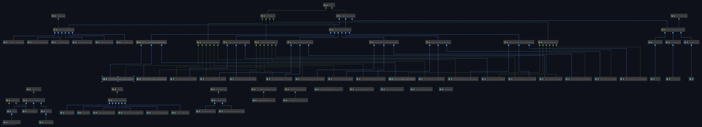

# CC3002 - PokemonTCG Game - Homework 2

This is the Homework 2 project, developed using the Java 1.8 SDK, and continued from the old Homework 1 project.
Includes all the files that implements the requested for this work. Here, you can see the UML Java class diagram.
Please refers to the full file "uml_diagram.png" in the GitHub repo root directory for a better view.

## Diseño

Para implementar lo solicitado en esta entrega, se utilizaron tres de los patrones de diseño vistos en clase:
Visitor, Template y NullObject.

### Visitor

Se utilizó el patrón de diseño Visitor para implementar, de partida, la desambiguación al jugar cada tipo de carta presenten en el juego:
TrainerCard, PokemonCards y EnergyCards y en particulara para cada subtipo de ellos, puesto que tienen funcionamientos distintos.

Además, se extendió el double dispatch realizado en la entrega anterior: sigue funcionando para desambiguar los tipos de los ataques, 
pero además ahora es capaz de desambiguar entre ataques y habilidades. También se utilizó para implementar la StadiumCard Frozen City.

Otra habilidad implementada utilizando Visitor fue el Energy Burn.

Todos los Visitor se encuentran en la subcarpeta Visitor y están debidamente testeados, cada uno de ellos en la carpeta de Testing.

### Template

Se utilizó el Template en casi toda la estructura de diseño de las cartas, fundamentalmente en los Pokemon.
A propósito de esto, se actualizó la estructura de todos los Pókemon: si bien antes contábamos con sólo un Pókemon para cada tipo,
ahora, para implementar las evoluciones, tenemos un BasicPokemon, un PhaseOnePokemon y un PhaseTwoPokemon, implementado según los requerimientos de la tarea.

### NullObject

Para no tener problemas en consultar por null o obtener  NullPointerException fundamentalmente, se implementaron NullAbility y NullEffect.

## Testing

De la tarea anterior, fueron conservados (y rediseñados) los 108 test. Además se implementaron 
21 nuevos test, para todas las funcionalidades solicitadas en esta tarea. Para la habilidad, referirse a test.cc3002.abilities.EnergyBurnTest.java.
y para el ataque, test.cc3002.abilities.ElectricShockTest.java. Los test de evolucionar Pokemon están presentes en test.cc3002.pokemon.pokemonevolvingtest.
La ObjectCard y la SupportCard se testean en test.cc3002.trainercards. Finalmente, la lógica del controlador, las cartas que se pueden usar una vez por turno
y el efecto de la StadiumCard se pueden encontrar testeadas en test.cc3002.PokemonGameControllerTest.java. :)

## Authors

* **F. Giovanni Sanguineti** - *Universidad de Chile* - [git repo](https://github.com/fgsanguineti/)

